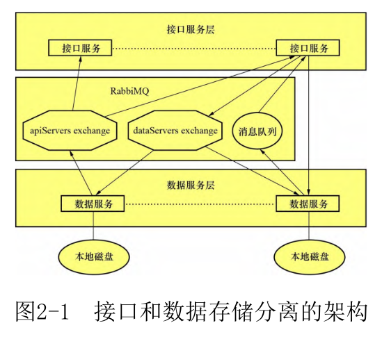
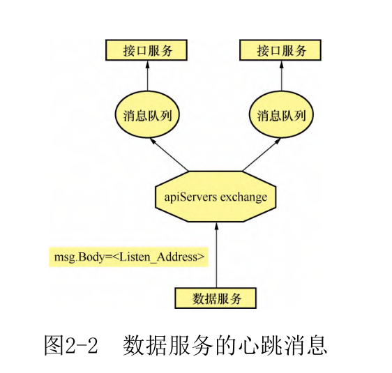
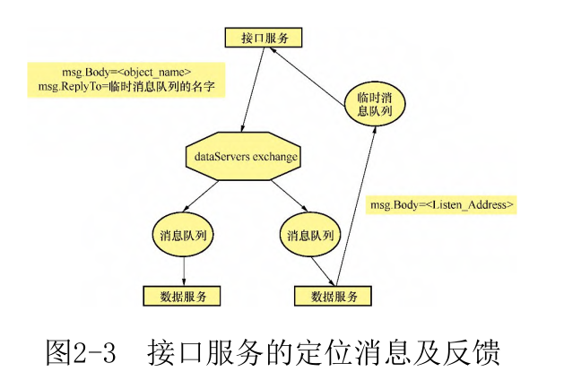

### chapter 2

### chapter 3

在现实世界,一个散列函数hash的安全级别根据以下3种属性决定。
- 抗原像攻击:给定一个散列值h,难以找到一个数据m令h=hash(m)。这个属性称为函数的单向性。欠缺单向性的散列函数易受到原像攻击。
- 抗第二原像攻击:给定一个数据m1,难以找到第二个数据m2令hash(m1)= hash(m2)。欠缺该属性的散列函数易受到第二原像攻击。
- 抗碰撞性:难以找到两个不同的数据m1和m2令hash(m1)=hash(m2)。这样的一对数据被称为散列碰撞。

