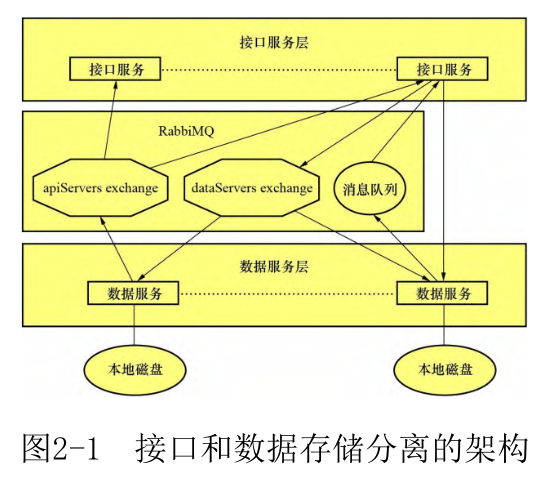
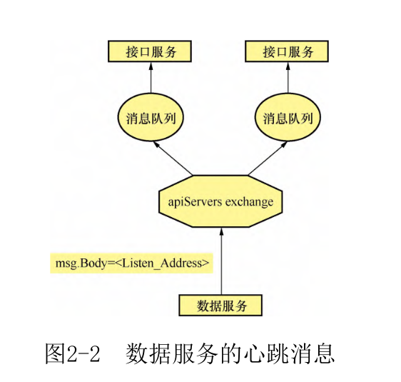
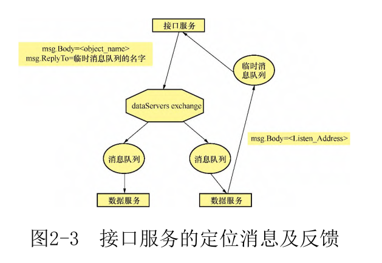
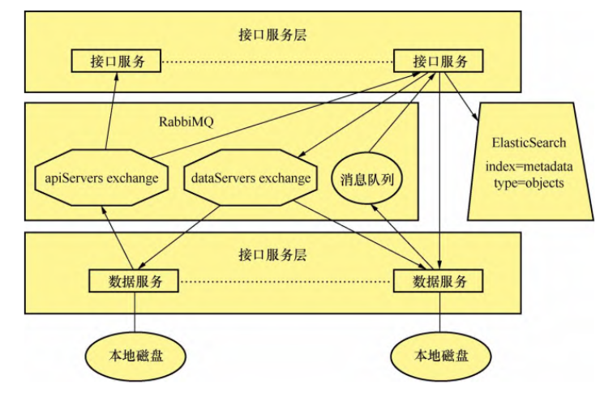

# chapter 1

# chapter 2

# chapter 3

在现实世界,一个散列函数hash的安全级别根据以下3种属性决定。
- 抗原像攻击:给定一个散列值h,难以找到一个数据m令h=hash(m)。这个属性称为函数的单向性。欠缺单向性的散列函数易受到原像攻击。
- 抗第二原像攻击:给定一个数据m1,难以找到第二个数据m2令hash(m1)= hash(m2)。欠缺该属性的散列函数易受到第二原像攻击。
- 抗碰撞性:难以找到两个不同的数据m1和m2令hash(m1)=hash(m2)。这样的一对数据被称为散列碰撞。

# chapter 4

去重基于对象的全局唯一标识符,也就是通过对该对象的散列值进行单例检查(Single Instance Storage,SIS)来实现。

# chapter 5

去重是帮助我们避免同一个对象在系统中到处都被保存一份副本,而冗余是在完全受我们控制的情况下增加这个对象数据的稳定性。

### **数据丢失**
传输、处理、存储、数据降解出现。

数据降解是由数据存储设备的非关键故障累积导致的数据逐渐损坏,即使在没有发生任何软件错误或硬件损坏的情况下,存储介质上的数据依然有可能随时间的推移而丢失。比如说,固态硬盘会由于存在缺陷的绝缘封装工艺而导致其中保存的电荷慢慢流失;磁盘上保存的比特会随时间的推移而消磁;潮湿温暖的空气会加速磁性材质的降解等。

### **数据冗余**

数据冗余是指在存储和传输的过程中,除了实际需要的数据,还存在一些额外数据用来纠正错误。这些额外的数据可以是一份简单的原始数据的复制,也可以是一些经过精心选择的校验数据,允许我们在一定程度上检测并修复损坏的数据。

- 多副本冗余
- Reed Solomon纠删码，在编码理论学中,RS纠删码属于非二进制循环码,它的实现基于有限域上的一元多项式。

### **如何评价冗余策略**

评价一个冗余策略的好坏,主要是衡量该策略对存储空间的要求和其抗数据损坏的能力。对存储空间的要求是指我们采用的冗余策略相比不使用冗余要额外支付的存储空间,以百分比表示;抗数据损坏的能力以允许损坏或丢失的对象数量来衡量。

对于一个M+N的RS码(M个数据片加N个校验片),其对存储空间的要求是(M+N)/M*100%,抵御能力是N。

